# Data Lovers

## 1. Resumen del proyecto

En este proyecto construimos una _página web_ de League of Legends para visualizar un
_conjunto (set) de datos_** que se adecúe a lo que tu usuario necesita.
En este caso nuestra página esta definida para usuarios principientes del juego LoL, por lo que esta páginas les ayudará a conocer mas informacion del juego, tipos de escenario y tipo de Campeones, de estos cada uno posee una descripción que el usuario podra ver, y asi poder elegir el Campeón que mas le acomode para jugar o ver las caracteristicas de sus enemigos.

## UX

Diseñamos una aplicación que tuviera la apariencia muy similar al juego, para que sea amigable y sea asociativo con el juego en si.
Nuestra idea fue que de una manera facil tuviera una breve explicación de juego, tipos de escenario y fichas de cada campeon, donde pueda filtrar por Rol de participante.

### Prototipos
Nuestro primer prototipo de baja fidelidad
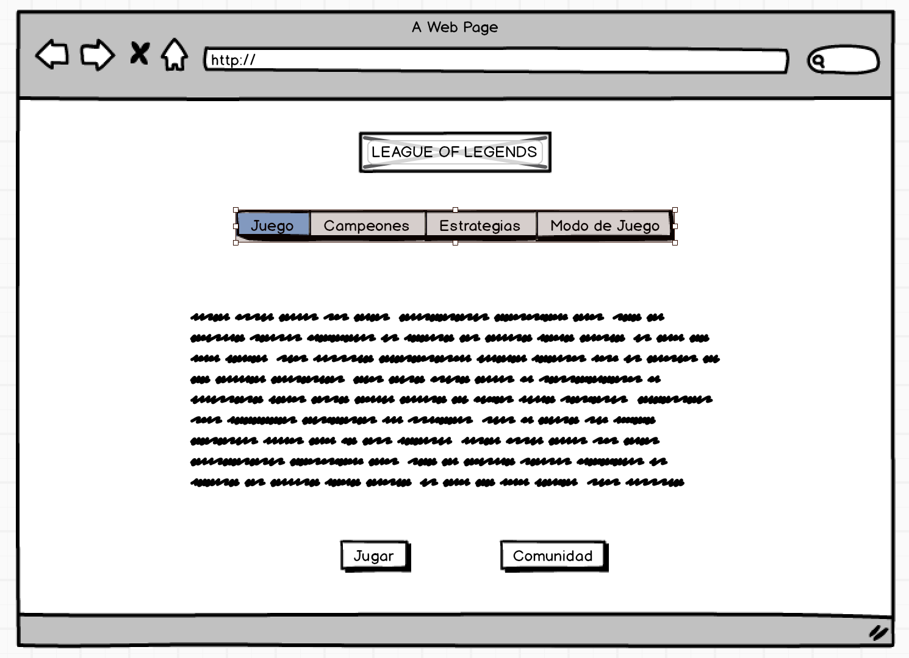
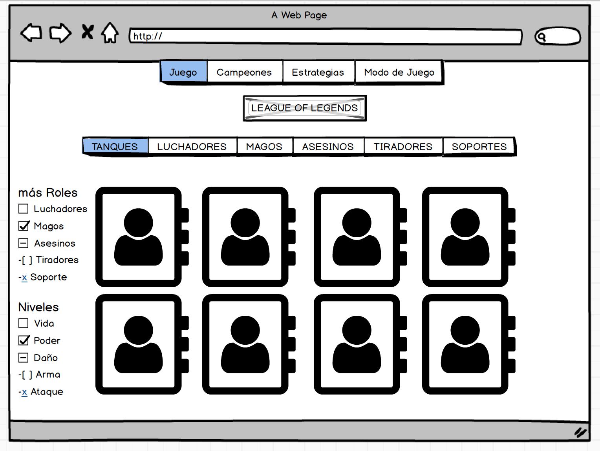

Nuestro prototipo de figma de alta fidelidad 
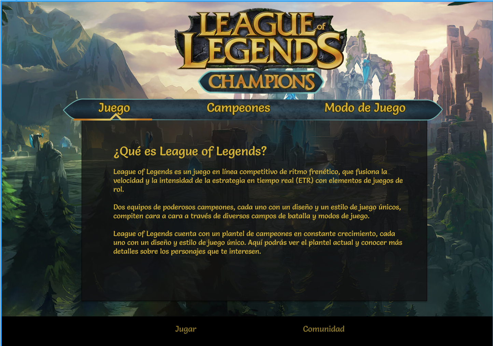

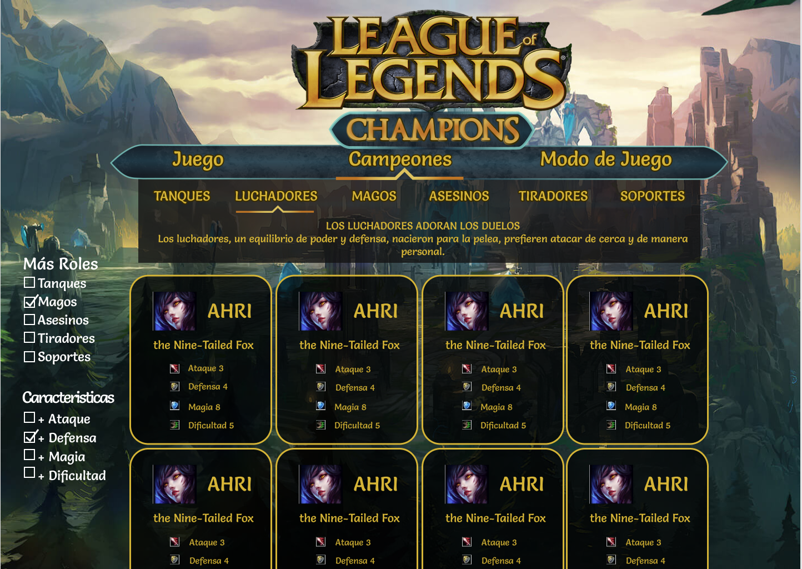

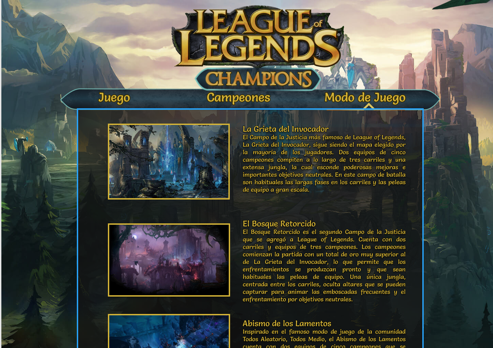

Nuestro prototipo de figma de alta para movil
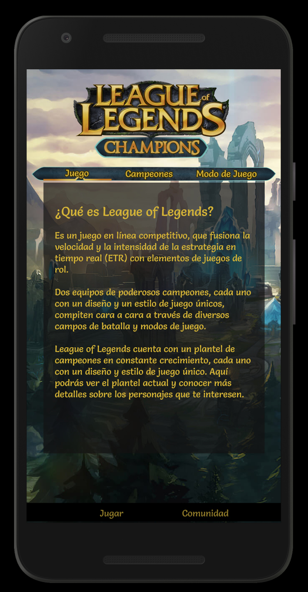

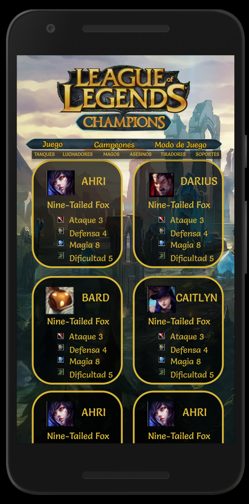

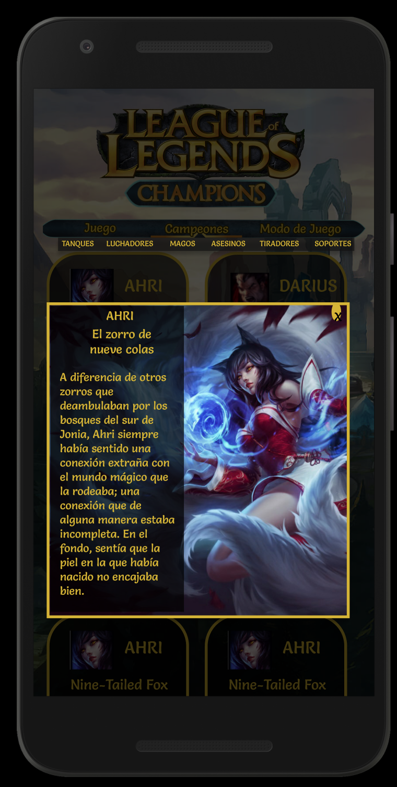

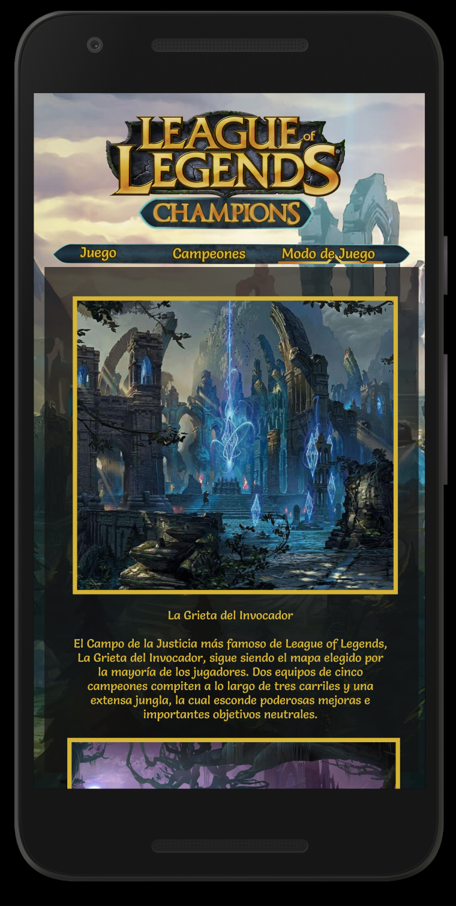

Luego de la iteracion de la clase de Diseño  visual, realizamos cambios de alineación, sacar un poco de texto, sacar textos justificados y los filtros del costado fueron eliminados luego de un test, ya que no les era relevante para los jugadores.

#### Prototipo Final
 Finalmente quedo este prototipo de alta, con sus funcionalidades

\* Prototipo de alta fidelidad con interacción  [link](https://www.figma.com/proto/LynLS0PcBw9G9HMFBNrTWb/Untitled?node-id=1%3A2&scaling=min-zoom)

### Test de Usabilidad

\* Test Usabilidad 1 [link](https://www.loom.com/share/6a69a8a81cdf49728be725f0899da41b)

\* Test Usabilidad 2 [link](https://www.loom.com/share/67137d086112499793ff9c79a10626f7)

\* Test Usabilidad 3 [link](https://www.loom.com/share/1ca008c121a44f7983e00cb6b6e5937c)

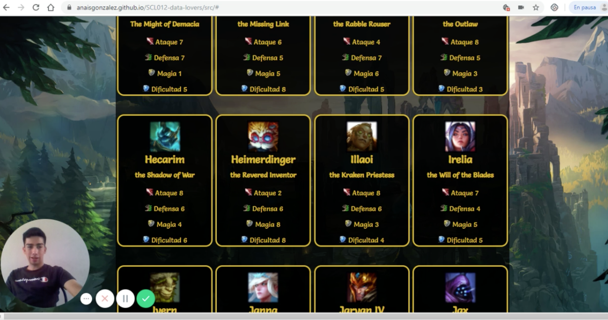
\* Test Usabilidad 4 [link](https://www.loom.com/share/6696240716d14d01a69407a615462890)

\* Test Usabilidad 5 [link](https://www.loom.com/share/b4a7464325ce4278b424ff059184e05d)

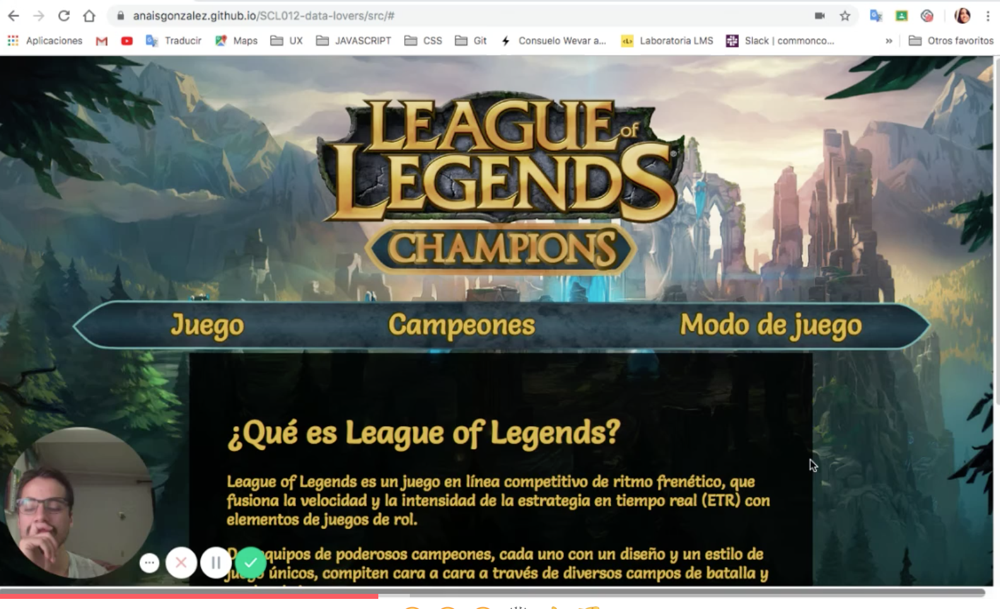
\* Test Usabilidad 6 [link](https://www.loom.com/share/3f967d8da93b40349248eb485412625a)

### Test con pagina final e Historia de usuario

Nuestro objetivo fue que el usuario pudiera buscar un rol espeficico y pudiera ver su descripción, lo que se cumple sin problema, todos los usuarios no tuvieron problema en identificar las funciones de cada boton y hacer lo pedido sin desorientarse en la página.

\* Test Usabilidad 7 [link](https://www.loom.com/share/29dcdcb4de654d06907cb10d1d67bedc)

## Objetivos
En este proyecto manejamos DOM y sus eventos, HTML semantico y CSS, nos basamos siempre en el diseño de la maqueta modificando solo cosas pequeñas a medida de los testeos.
Logramos ejecutar comandos de git, utilizar los repositorios y colaborar en Github.
En javascript logramos los objetivos de filtrar y manipular objetos.

